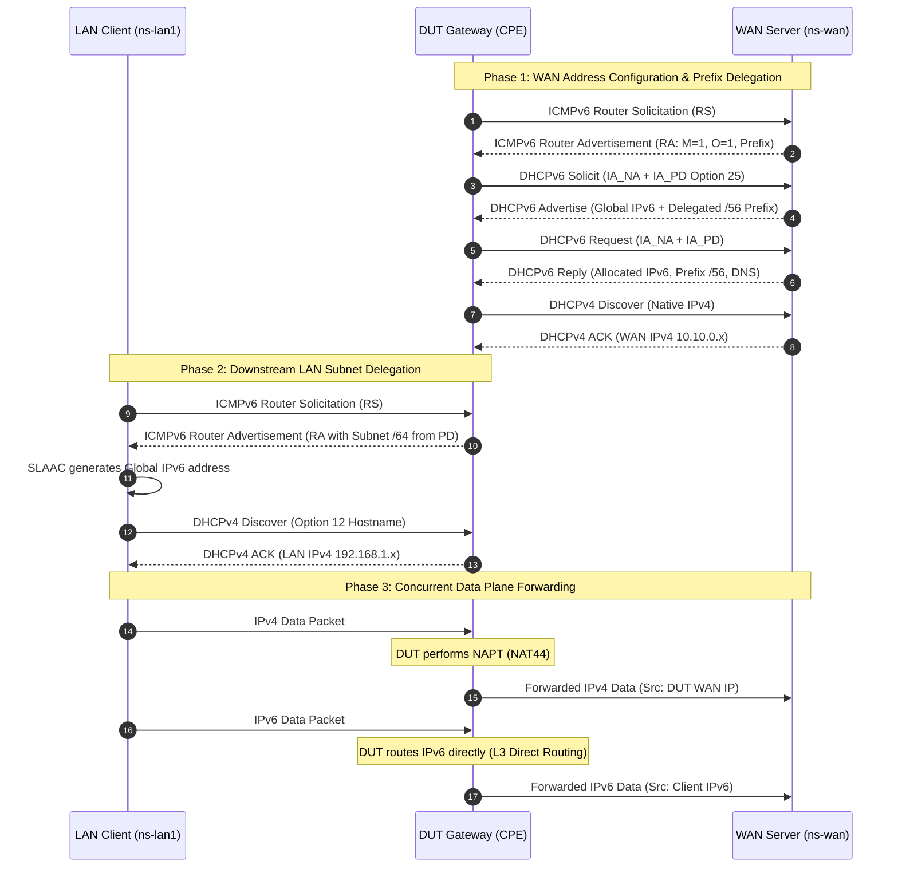
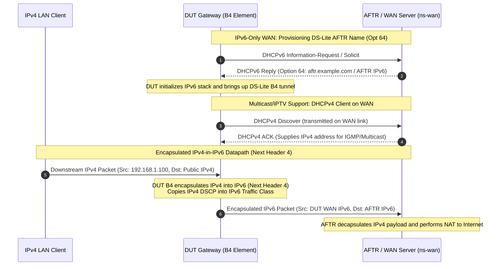
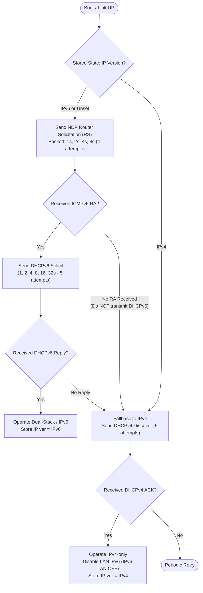

# IPv6 Gateway Test Lab

Generic Linux-based test lab framework for validating IPv4/IPv6 gateway behavior, Dual Stack, DS-Lite Tunneling, and Prefix Delegation across physical and simulated network datapaths.

The project contains technical information only. It intentionally avoids customer names, private project identifiers, requirement IDs, and internal naming.

---

## 1. Architecture & Deployment Topologies

The test lab supports three deployment modes:
- **Mode 1: Physical Single-PC (Dual-NIC)** (`LAB_ROLE="single"`): A single host with two USB Ethernet adapters connected to DUT WAN and LAN ports.
- **Mode 2: Physical Distributed Two-PC** (`LAB_ROLE="wan"` / `"lan"`): Two independent hosts coordinated via SSH.
- **Mode 3: Virtual / No-DUT Simulation** (`--virtual`): Pure software simulation using Linux Network Namespaces (`ns-dut`) for local testing and CI/CD pipelines without physical hardware.

### Physical Single-PC Topology

```text
+-------------------------------------------------------------------------------+
|                                Linux Host PC                                  |
|                                                                               |
|  [ns-wan] (WAN Server Emulator)               [ns-lan1] (LAN Client)          |
|    - radvd (SLAAC / RDNSS)                       - udhcpc (Option 12/60)      |
|    - Kea DHCPv4 Server                           - SLAAC / DHCPv6 Client      |
|    - Kea DHCPv6 (IA_NA + IA_PD + AFTR)           - iperf3 client              |
|    - AFTR DS-Lite Endpoint                       - tshark / tcpdump           |
|            | (veth: eth0)                                 | (veth: eth0)      |
|     [br-test-wan]                                  [br-test-lan]              |
|            |                                              |                   |
|     (WAN_IF: USB NIC 1)                            (LAN_IF: USB NIC 2)        |
+------------|----------------------------------------------|-------------------+
             |                                              |
             v                                              v
      +--------------+                              +---------------+
      |   WAN Port   |       [ DUT Gateway ]        |   LAN Port    |
      |              |  - Dual Stack (NAT44 + L3 v6)|               |
      |              |  - DS-Lite (B4 Tunnel)       |               |
      |              |  - HW Offload Acceleration   |               |
      +--------------+                              +---------------+
```

---

## 2. Protocol Sequence Diagrams

### 2.1. Dual-Stack: Stateful DHCPv6 + Prefix Delegation (IA_PD)



### 2.2. IPv6-Only WAN & DS-Lite Tunneling (RFC 6333) + Multicast DHCPv4



### 2.3. Network Auto-Detection & State Retention



---

## 3. IP Subnet & Parameter Allocation Table

| Network Domain | Address / Prefix | Assignment Protocol | Description |
|---|---|---|---|
| **WAN IPv4 Subnet** | `10.10.0.0/24` | Kea DHCPv4 Server | Assigned to DUT physical WAN port |
| **WAN IPv6 Prefix** | `2001:db8:10::/64` | radvd (SLAAC) / Kea DHCPv6 | Global Unicast address pool for WAN |
| **Prefix Delegation (PD)** | `2001:db8:100::/56` | Kea DHCPv6 IA_PD (Option 25) | Delegated prefix pool carved by DUT |
| **DS-Lite AFTR** | `2001:db8:10::affe` | DHCPv6 Option 64 (`aftr-name`) | Destination endpoint for IPv4-in-IPv6 tunnel |
| **LAN IPv4 Subnet** | `192.168.1.0/24` | DUT DHCPv4 Server / Static | Private subnet serving downstream hosts |
| **LAN IPv6 Subnet** | `2001:db8:100:1::/64` | DUT RA / SLAAC (from PD prefix) | Subnet /64 carved from delegated /56 prefix |

---

## 4. Quickstart Execution Guide

### Step 1: Prepare Environment Configuration
```bash
cp config.env.example config.env
# Update adapter names for hardware testing:
# WAN_IF="enxd46e0e0c65e1"
# LAN_IF="enx00e04c88293c"
```

### Step 2: Initialize Topology
```bash
# Option 1: Run virtual simulation without hardware (Recommended for CI / dev)
sudo ./scripts/setup.sh --virtual

# Option 2: Run on physical hardware with two dedicated adapters
sudo ./scripts/setup.sh --single
```

### Step 3: Run Diagnostics
```bash
./scripts/diagnose.sh
```

### Step 4: Run Automated Test Scenario
```bash
# Run default Dual-Stack scenario:
sudo ./scripts/scenario.sh dual-stack

# Or run specialized scenarios:
sudo ./scripts/scenario.sh slaac
sudo ./scripts/scenario.sh stateful-v6
sudo ./scripts/scenario.sh ipv6-only-dslite
```

### Step 5: Check Status & Analyze Capture Evidence
```bash
# Check runtime state:
./scripts/show_state.sh

# Analyze packet capture evidence with PASS/FAIL report:
./scripts/verify_capture.sh captures/last_capture.pcap
```

### Step 6: Cleanup Resources
```bash
sudo ./scripts/cleanup.sh
```

---

## 5. DUT Firewall Rules

To ensure DUT WAN does not drop server responses during testing:

### IPTables on DUT:
```bash
iptables -I INPUT -i eth1 -p udp --sport 67 --dport 68 -j ACCEPT
ip6tables -I INPUT -i eth1 -p udp --sport 547 --dport 546 -j ACCEPT
ip6tables -I INPUT -i eth1 -p 4 -j ACCEPT
```

### NFTables on DUT:
```nft
iifname "eth1" udp sport 67 udp dport 68 counter accept comment "Allow DHCPv4 Server responses"
iifname "eth1" udp sport 547 udp dport 546 counter accept comment "Allow DHCPv6 Server responses"
iifname "eth1" ip6 nexthdr 4 counter accept comment "Allow DS-Lite IPv4-in-IPv6 packets"
```
